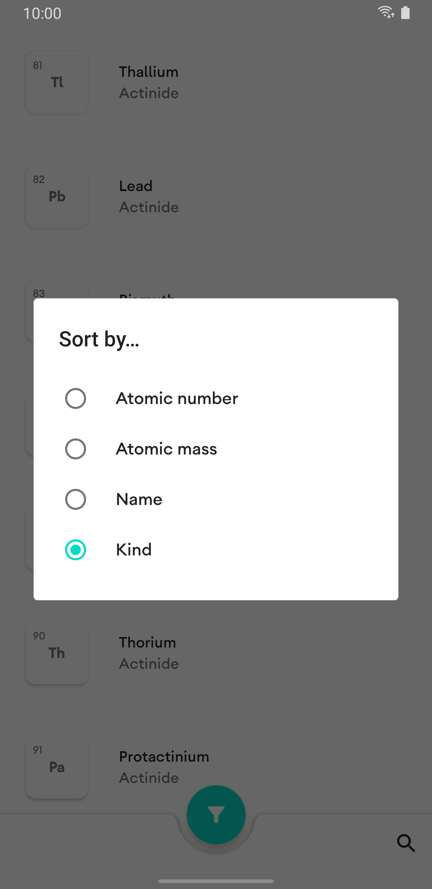

<br />
<p align="center">
  <a href="https://github.com/othneildrew/Best-README-Template">
    
  </a>

  <h3 align="center">Period</h3>

  <p align="center">
    The periodic table of elements, right in your pocket.
</p>

<details open="open">
  <summary>Table of Contents</summary>
  <ol>
    <li>
      <a href="#about-the-project">About</a>
      <ul>
        <li><a href="#built-with">Built With</a></li>
      </ul>
    </li>
    <li>
      <a href="#getttng-started">Getting Started</a>
      <ul>
        <li><a href="#prerequisites">Prerequisites</a></li>
        <li><a href="#installation">Installation</a></li>
      </ul>
    </li>
    <li><a href="#contributing">Contributing</a></li>
    <li><a href="#license">License</a></li>
    <li><a href="#contact">Contact</a></li>
  </ol>
</details>

## About

<div align="center" style="margin-top: 60px; margin-bottom: 50px">
    
    
    
</div>

Period allows you to carry the periodic table of elements right in your pocket. For now, it has features like sorting and searching. Its modules, as seen in the project structure, are separated by :ui (XML layouts and custom Views), :data (data and sealed classes), :extensions (Kotlin extension functions) and the main one, :app, which just implements all the other ones and is responsible for actually running the app.

### Built With

This project is mainly built with [Kotlin](https://kotlinlang.org/).

## Getting Started

### Prerequisites

- Android Studio
- Android SDK
- Android Emulator or a real device, with [USB debugging](https://developer.android.com/studio/debug/dev-options?authuser=1#enable) turned on

### Installation

1. Clone the repo.
   ```sh
   git clone https://github.com/jeanbarrossilva/Period.git
   ```
2. File > Open in Android Studio, and select the project.
3. Click Run or `Shift` + `F10`.

## Contributing

Contributions are what make the open source community such an amazing place to be learn, inspire, and create. Any contributions you make are **greatly appreciated**.

1. Fork the Project.
2. Create your Feature Branch (`git checkout -b feature/my-feature`).
3. Commit your Changes (`git commit -m 'Add some feature'`).
4. Push to the Branch (`git push origin feature/my-feature`).
5. Open a Pull Request!

## License

Distributed under the MIT License. See `LICENSE` for more information.

## Contact

Jean Silva - [@jeanbarrossilva](https://twitter.com/jeanbarrossilva) - jeanbarrossilva@outlook.com
